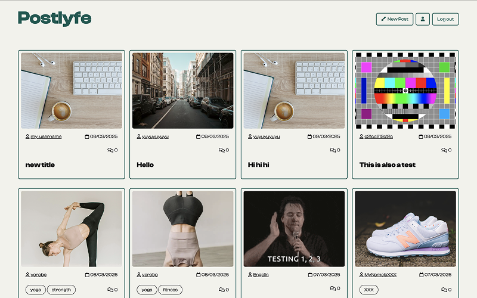
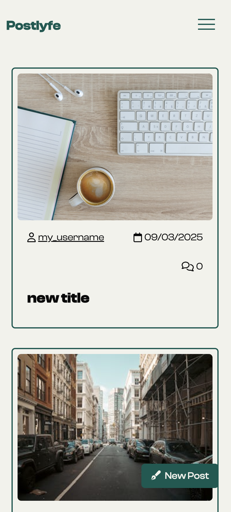
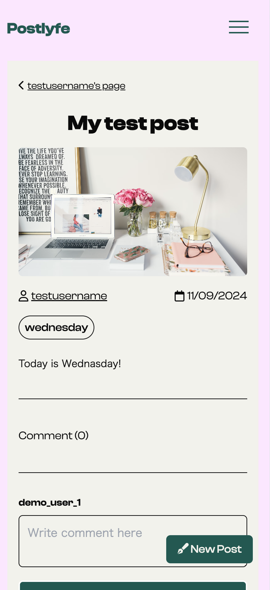
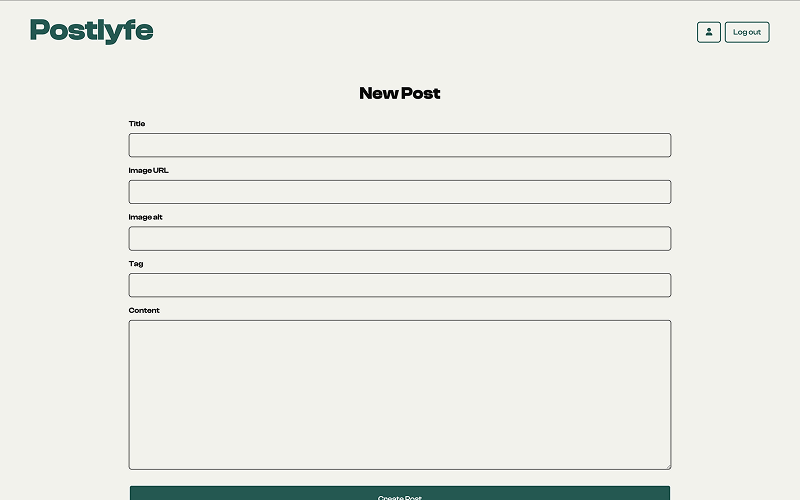
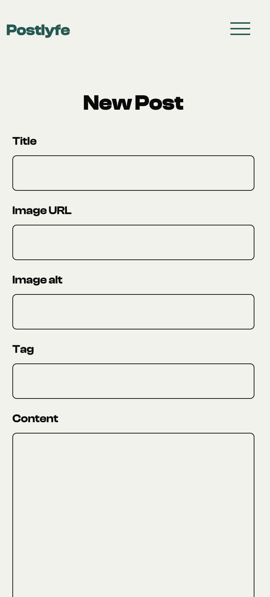

# Postlyfe

## Overview

This project is a client-side social media application where users can create, view, edit, and delete their posts. The application also includes features for user authentication, following/unfollowing other users, and interacting with posts through comments.
The app interacts with a backend API to perform CRUD operations (Create, Read, Update, and Delete) on posts, and it uses JWT (JSON Web Tokens) for user authentication.

## Live Demo

[Deployed Application](https://postlyfe.netlify.app/)

## Technologies Used

- JavaScript
- Vite
- HTML
- CSS (Tailwind CSS)
- Fetch API
- localStorage (for token storage)

## Features

- **User Authentication**: Users can register, log in, and log out.
- **Post Management**: Users can create, view, edit, and delete their posts.
- **Follow / Unfollow**: Users can follow and unfollow other users.
- **Comment on posts**: Users can comment on posts.
- **Post Listings**: Displays recent posts and individual post details.
- **Responsive Design**: Designed for desktop and mobile devices using Tailwind CSS.

## Highlights / Unique Implementations

- **Authentication**: Tokens are stored in localStorage to maintain user sessions across page reloads.
- **Post Management System**:Users can create, edit, and delete their posts. These posts are dynamically rendered, and interactions such as post editing are seamlessly handled via the API.
- **Follow / Unfollow System**: A feature where users can follow or unfollow other users, building a social network within the app.
- **Responsive Layout**: Tailwind CSS is used to create a responsive layout, ensuring the app is usable across various devices and screen sizes

## Installation & Setup

1. Clone the repository:
   ```sh
   git clone https://github.com/NoroffFEU/fed2-js2-ca-H-chai.git
   ```
2. Navigate to the project folder:
   ```sh
   cd fed2-js2-ca-H-chai
   ```
3. Install dependencies:
   ```sh
   npm install
   ```
4. Start the development server:
   ```sh
   npm run dev
   ```
5. Open [http://localhost:5173](http://localhost:5173) in your browser.

## Demo Account Information

To try out the demo, you can register an account using the following guidelines:

### Registration Requirements:

- **Username**: The username must not contain punctuation symbols apart from an underscore (\_).
- **Email**: The email must be a valid `stud.noroff.no` email address.
- **Password**: The password must be at least 8 characters long.

### Example Registration:

- **Username**: demo_user_1
- **Email**: demo_user_1@stud.noroff.no
- **Password**: Password123

You can use this information to log in and try out the features of the site.

## API

This project interacts with the provided [Noroff Social Media API](https://docs.noroff.dev/docs/v2) to handle user authentication, post creation, post management, and more.

### Authentication

- **Register a new user**

  ```sh
  POST https://api.noroff.dev/auth/register
  ```

- **Login**
  ```sh
  POST https://api.noroff.dev/auth/login
  ```

### Posts

- **Get all posts**

  ```sh
  GET https://api.noroff.dev/social/posts
  ```

- **Create a new post**

  ```sh
  POST https://api.noroff.dev/social/posts
  ```

- **Get a single post**

  ```sh
  GET https://api.noroff.dev/social/posts/{id}
  ```

- **Edit a post**

  ```sh
  PUT https://api.noroff.dev/social/posts/{id}
  ```

- **Delete a post**

  ```sh
  DELETE https://api.noroff.dev/social/posts/{id}
  ```

- **Comment on a post**
  ```sh
  POST https://api.noroff.dev/social/posts/{id}/comment
  ```

### User Follow/Unfollow

- **Follow a user**

  ```sh
  PUT https://api.noroff.dev/social/profiles/{name}/follow
  ```

- **Unfollow a user**
  ```sh
  PUT https://api.noroff.dev/social/profiles/{name}/unfollow
  ```

### User Profile

- **Get user profile**

  ```sh
  GET https://api.noroff.dev/social/profiles/{name}

  ```

- **Update user profile**

  ```sh
  PUT https://api.noroff.dev/social/profiles/{name}

  ```

- **View user’s posts**
  ```sh
  GET https://api.noroff.dev/social/profiles/{name}/posts
  ```

## Project Structure

```
/auth
  ├── login
  │   ├── index.html # Login page
  ├── register
  │   ├── index.html # Registration page
/post
  ├── create
  │   ├── index.html # Create post page
  ├── edit
  │   ├── index.html # Edit post page
  ├── feed
  │   ├── index.html # Feed page
  ├── index.html # Single post page
/profile
  ├── update
  │   ├── index.html # Profile update page
  ├── index.html # Profile page
/public
  ├── images # Static image
/src
  ├── css
  ├── js
  │   ├── api
  │   │   ├── constants.js # API base URLs and constants
  │   │   ├── headers.js # API request headers
  │   │   ├── instance.js # API instance creation
  │   │   ├── index.js # API request functions
  │   ├── ui
  │   │   ├── post
  │   │   │   ├── generateFeedHTML.js # Generate feed html dynamically
  │   │   │   ├── generateSinglePostHTML.js # Generate single post html dynamically
  │   │   ├── index.js # Main UI logic/functions
  │   ├── utilities
  │   │   ├── authGuard.js
  │   │   ├── formatDate.js
  ├── app.js # Main script file
index.html # Entry point (homepage)
```

## Future Improvements

- **Post Filters**: Implement a filtering system for posts, such as by date, popularity, or categories (e.g., text posts, image posts).

- **Emoji Reactions**: Implement a feature that allows users to react to posts with emojis. This would enable users to express emotions or feedback on a post in a more engaging and interactive way. The system could support popular emojis like thumbs up, heart, smiley face, etc., and users could see the number of reactions for each emoji on a post.

## Screenshots

### Homepage

#### Desktop



#### Mobile



### Post Page

#### Desktop


#### Mobile



### Create Page

#### Desktop



#### Mobile


